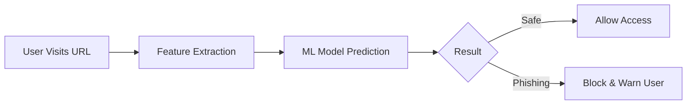

# 🛡️ Vigil Is Online

### *Real-Time Phishing Detection & Browser Protection System*

<p align="center">
  
  
  
</p>

---

## 🚀 Overview

**Vigil Is Online** is an intelligent cybersecurity solution designed to detect and block phishing websites in real time.

It combines **machine learning**, **feature engineering**, and a **browser extension** to proactively protect users from malicious URLs.

> ⚡ Built for speed, accuracy, and real-world usability.

---

## ✨ Key Features

* 🔍 **AI-Based URL Detection** — Classifies phishing vs legitimate links
* 🌐 **Browser Extension Integration** — Real-time protection while browsing
* 🧠 **Pre-trained ML Model** — Instant predictions
* 📊 **Feature Extraction Engine** — Deep URL analysis
* 🚫 **Live Blocking System** — Stops malicious sites before they load

---

## 🧠 How It Works



---

## ⚙️ Installation

> 🚧 *Setup instructions coming soon — currently under refinement.*

More setup steps will be added soon.

---

## ▶️ Usage


# Run the application
```bash
python app.py
```

## 🌐 Browser Extension

* Monitors URLs in real time
* Detects phishing attempts
* Blocks dangerous sites instantly

> Setup guide will be added soon.

---

## 📊 Tech Stack

| Layer               | Technology Used       |
| ------------------- | --------------------- |
| 🧠 Machine Learning | Scikit-learn          |
| 🐍 Backend          | Python                |
| 🌐 Extension        | JavaScript, HTML, CSS |
| 📊 Data Handling    | Pandas, NumPy         |

---

## 📈 Future Scope

* 🚀 Deploy as a cloud-based API
* 🧠 Integrate deep learning models
* 🌍 Multi-browser support
* 📱 Mobile browser protection
* 🔐 Real-time threat intelligence

---

<p align="center">
  🔐 Stay Safe. Stay Vigilant.
</p>
