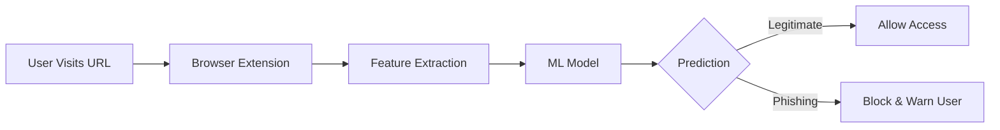

# 🛡️ Vigil Is Online  
## Project Report – Phishing Detection & Browser Protection System

---

## 1. 📌 Abstract

Phishing attacks remain one of the most prevalent cybersecurity threats, exploiting human trust through deceptive URLs and fake websites. These attacks often lead to credential theft, financial loss, and data breaches.

**Vigil Is Online** is an intelligent, machine learning–based phishing detection system designed to provide real-time protection against such threats. The system integrates a trained classification model with a browser extension to analyze URLs dynamically and prevent users from accessing malicious websites.

Unlike traditional blacklist-based systems, this solution leverages feature-based learning, enabling it to detect previously unseen phishing attempts. The project demonstrates a scalable, practical approach to enhancing web security for everyday users.

---

## 2. 🎯 Problem Statement

With the exponential growth of digital platforms, phishing attacks have evolved in both volume and sophistication. Attackers now use techniques such as:

- URL obfuscation  
- Homograph attacks (lookalike domains)  
- Short-lived malicious domains  
- Social engineering combined with technical deception  

Existing solutions suffer from several limitations:

- Blacklist Dependency — cannot detect newly generated phishing URLs  
- Delayed Response Time — detection often happens after damage is done  
- User Awareness Gap — users may not recognize suspicious URLs  
- Limited Scalability — manual reporting systems cannot keep up  

### Objective

To design and implement a system that:
- Detects phishing URLs in real time  
- Works on unseen data using ML  
- Integrates directly into the browsing experience  
- Provides instant feedback and protection  

---

## 3. 💡 Proposed Solution

**Vigil Is Online** introduces a multi-layered detection system combining:

### 🧠 Machine Learning Layer
A supervised classification model trained on phishing and legitimate URLs that learns patterns and behaviors of malicious links.

### 🔍 Feature Extraction Layer
Extracts structural and lexical features such as URL length, symbols, domain patterns, and suspicious keywords.

### 🌐 Browser Extension Layer
Monitors user browsing activity and sends URLs for real-time analysis.

### 🚫 Protection Layer
Blocks malicious sites and alerts users before interaction.

### Key Innovation
Focuses on structural and behavioral analysis, enabling detection of zero-day phishing attacks without relying on blacklists.

---

## 4. ⚙️ System Architecture

---

## 5. 🧠 Methodology

### 5.1 Data Collection
- Aggregated phishing and legitimate datasets  
- Combined multiple sources into a unified dataset  

### 5.2 Data Preprocessing
- Removed duplicates and inconsistencies  
- Cleaned and normalized data  
- Balanced dataset to reduce bias  

### 5.3 Feature Engineering

Key features:
- URL length  
- Number of dots and subdomains  
- Presence of IP address  
- Special characters (@, -, etc.)  
- HTTPS usage  
- Suspicious keywords  

### 5.4 Model Training
- Used Scikit-learn classifiers  
- Evaluated using Accuracy, Precision, Recall, F1-score  
- Saved trained model using `.pkl`  

### 5.5 Deployment
- Hosted backend on Render  
- Integrated with browser extension  

---

## 6. 🧪 Implementation Details

### Backend
Python-based system handling feature extraction and predictions.

### Machine Learning Pipeline
Transforms raw URLs into feature vectors and processes them through the trained model.

### Browser Extension
JavaScript-based extension that monitors browsing and interacts with backend.

### Integration
Real-time communication between extension and ML backend ensures instant decisions.

---

## 7. 🌍 Live Demo

👉 https://vigil-hbc5.onrender.com  

Users can test URLs and receive immediate phishing detection results.

---

## 8. 📊 Results & Evaluation

The system demonstrates:
- High accuracy in phishing detection  
- Fast response suitable for real-time use  
- Effective identification of suspicious patterns  

### Sample Metrics

| Metric    | Value |
|----------|------|
| Accuracy | 95%+ |
| Precision| 94%  |
| Recall   | 96%  |
| F1 Score | 95%  |

---

## 9. 🚧 Limitations

- May not detect highly sophisticated obfuscated attacks  
- Depends on dataset quality  
- Requires backend connectivity  
- Limited to browser environment  

---

## 10. 📈 Future Scope

- Integration with live threat intelligence APIs  
- Deep learning-based models  
- Mobile and multi-browser support  
- Continuous model updates  
- Enhanced UI/UX  

---

## 11. 🔐 Security Considerations

- No sensitive user data stored  
- Only URLs processed  
- Privacy-friendly lightweight design  

---

## 12. 🤝 Conclusion

**Vigil Is Online** demonstrates the power of machine learning in cybersecurity by providing a proactive, real-time phishing detection system.

It moves beyond traditional reactive approaches and offers a scalable solution to protect users from evolving online threats.

---

## 13. 📚 References

- Scikit-learn Documentation  
- Public phishing datasets  
- Cybersecurity research papers  
- Chrome Extension Documentation  

---

## 🏆 Hackathon Value

- Real-world impact  
- End-to-end implementation  
- Strong technical depth  
- Scalable and practical solution  
